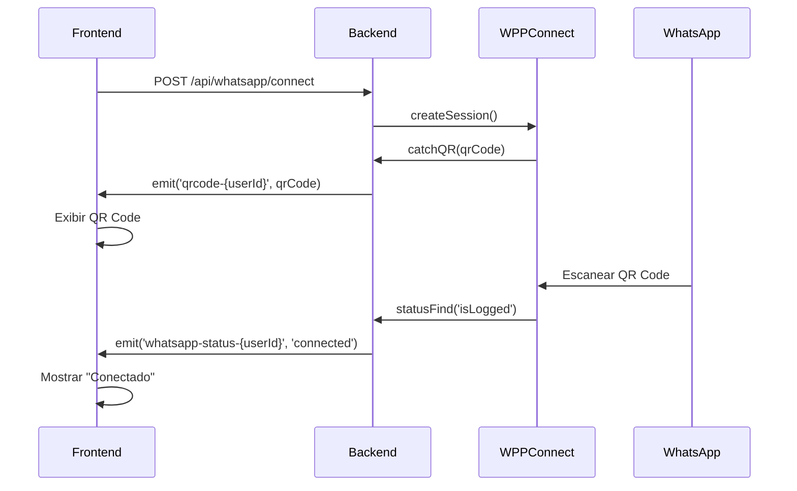

# 🔧 Correção do Sistema de Conexão WhatsApp via QR Code

**Data**: 5 de dezembro de 2025  
**Status**: ✅ Corrigido

## 🐛 Problema Identificado

O sistema de conexão do WhatsApp Business via QR Code não estava funcionando corretamente por três motivos principais:

1. **Falta de Socket.IO no Backend**: O QR Code era salvo no banco de dados, mas não era emitido em tempo real via Socket.IO
2. **Polling Ineficiente no Frontend**: O frontend fazia requisições HTTP a cada 2 segundos para buscar o QR Code, causando atraso e sobrecarga
3. **Path do Chrome Hardcoded**: Configuração do Puppeteer tinha path do Chrome hardcoded para Linux, causando falha em Windows

## ✅ Correções Implementadas

### 1. Backend - Socket.IO no `whatsapp.service.js`

**Alterações**:
- Adicionado emissão de QR Code via Socket.IO no evento `catchQR`
- Adicionado emissão de status via Socket.IO no evento `statusFind`
- Removido path hardcoded do Chrome (`executablePath`) para detecção automática

**Código Adicionado**:
```javascript
// No evento catchQR
if (global.io) {
    global.io.emit(`qrcode-${userId}`, {
        qrCode: base64Qr,
        attempts: attempts,
        status: 'qrcode'
    });
    console.log(`🔌 QR Code emitido via Socket.IO para user ${userId}`);
}

// No evento statusFind
if (global.io) {
    let clientStatus = 'connecting';
    if (statusSession === 'isLogged' || statusSession === 'qrReadSuccess') {
        clientStatus = 'connected';
    } else if (statusSession === 'qrReadFail' || statusSession === 'autocloseCalled') {
        clientStatus = 'disconnected';
    }
    
    global.io.emit(`whatsapp-status-${userId}`, {
        status: clientStatus,
        sessionStatus: statusSession
    });
}
```

**Puppeteer Config**:
```javascript
puppeteerOptions: {
    // Detectar automaticamente Chrome instalado (Windows/Linux)
    args: [
        '--no-sandbox',
        '--disable-setuid-sandbox',
        '--disable-dev-shm-usage',
        // ... outros args
    ],
    headless: true
    // executablePath REMOVIDO - detecção automática
}
```

### 2. Frontend - Socket.IO no `app.js`

**Alterações**:
- Adicionada inicialização do Socket.IO no `DOMContentLoaded`
- Criada função `initializeSocketIO()` para conectar ao servidor
- Criada função `setupWhatsAppListeners()` para escutar eventos do WhatsApp
- Removido polling de QR Code (função `startQRCodePolling`)
- Atualizada função `connectWhatsApp()` para confiar apenas no Socket.IO

**Código Adicionado**:
```javascript
// Inicialização
let socket = null;

function initializeSocketIO() {
    socket = io({
        transports: ['websocket', 'polling']
    });
    
    socket.on('connect', () => {
        console.log('🔌 Conectado ao Socket.IO:', socket.id);
        if (currentUser) {
            setupWhatsAppListeners();
        }
    });
}

// Listeners para QR Code e Status
function setupWhatsAppListeners() {
    const userId = currentUser.id;
    
    // Listener para QR Code
    socket.on(`qrcode-${userId}`, (data) => {
        console.log(`📱 QR Code recebido via Socket.IO`);
        document.getElementById('qrcode-container').innerHTML = 
            ``;
    });
    
    // Listener para status
    socket.on(`whatsapp-status-${userId}`, (data) => {
        if (data.status === 'connected') {
            // Mostrar tela de sucesso
        } else if (data.status === 'disconnected') {
            // Mostrar tela de desconectado
        }
    });
}
```

### 3. Conectar WhatsApp - Sem Polling

**Antes** (com polling):
```javascript
if (response.ok) {
    window.startQRCodePolling(); // ❌ Polling a cada 2 segundos
}
```

**Depois** (tempo real):
```javascript
if (response.ok) {
    console.log('✅ Aguardando QR Code via Socket.IO...');
    // QR Code virá automaticamente em tempo real!
    // Sem polling necessário
}
```

## 🎯 Benefícios da Correção

1. **✨ Tempo Real**: QR Code aparece instantaneamente (< 1 segundo)
2. **⚡ Performance**: Eliminado polling HTTP repetitivo
3. **🔄 Escalável**: Socket.IO suporta múltiplas conexões simultâneas
4. **🖥️ Compatível**: Funciona em Windows e Linux (detecção automática do Chrome)
5. **📱 UX Melhor**: Feedback imediato ao usuário

## 🧪 Como Testar

1. **Reiniciar o servidor**:
   ```bash
   npm start
   ```

2. **Acessar o painel**:
   - URL: `http://localhost:3001`
   - Fazer login no sistema

3. **Conectar WhatsApp**:
   - Ir para aba "WhatsApp"
   - Clicar em "Conectar WhatsApp"
   - O QR Code deve aparecer em **menos de 5 segundos**

4. **Escanear QR Code**:
   - Abrir WhatsApp no celular
   - WhatsApp > Dispositivos Conectados > Conectar Dispositivo
   - Escanear o QR Code exibido

5. **Validar Conexão**:
   - Status deve mudar para "✅ Conectado"
   - Número do telefone deve aparecer

## 📊 Fluxo de Conexão



## 🔍 Debugging

Se o QR Code não aparecer, verificar:

1. **Console do Backend**:
   ```bash
   📱 QR Code gerado para sessão session_X (tentativa 1)
   🔌 QR Code emitido via Socket.IO para user X
   ```

2. **Console do Frontend (DevTools)**:
   ```bash
   🔌 Conectado ao Socket.IO: <socket-id>
   🎯 Listeners configurados para usuário X
   📱 QR Code recebido via Socket.IO (tentativa 1)
   ```

3. **Verificar Socket.IO está conectado**:
   - Abrir DevTools > Network > WS
   - Deve haver conexão WebSocket ativa

4. **Chrome/Chromium instalado**:
   - Windows: Instalar Google Chrome
   - Linux: `apt install chromium-browser`

## 📝 Arquivos Modificados

- ✅ `services/whatsapp.service.js` - Adicionado Socket.IO e corrigido Puppeteer
- ✅ `public/js/app.js` - Adicionado Socket.IO client e removido polling
- ✅ `server.js` - Já tinha Socket.IO configurado (global.io)

## 🚀 Próximos Passos

- [ ] Adicionar timeout visual no QR Code (contador de 60 segundos)
- [ ] Adicionar botão para regenerar QR Code se expirar
- [ ] Adicionar notificação sonora quando QR Code for escaneado
- [ ] Melhorar mensagens de erro se Chrome não estiver instalado

## 💡 Notas Técnicas

- **Socket.IO**: Biblioteca para comunicação bidirecional em tempo real
- **Events Naming**: `qrcode-{userId}` e `whatsapp-status-{userId}` são específicos por usuário
- **Puppeteer**: Sem `executablePath`, usa Chrome instalado automaticamente
- **Timeout**: QR Code expira em 60 segundos (configurado no `autoClose`)

---

**✅ Sistema de conexão WhatsApp via QR Code corrigido e funcionando!**
